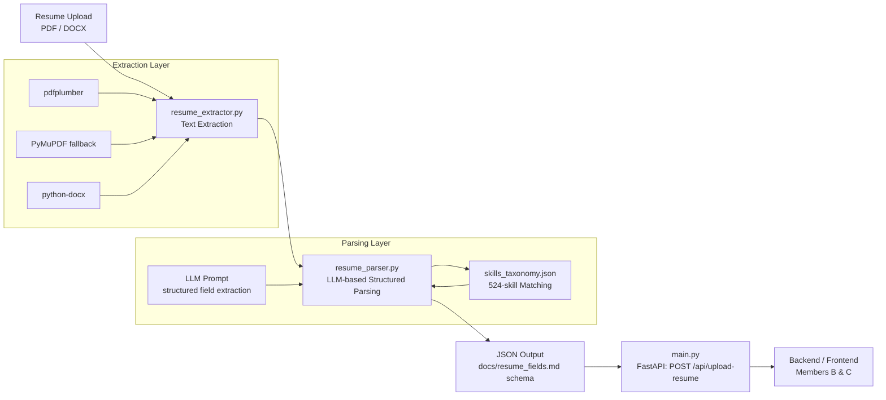

# ML Module — Resume Parsing & Data Extraction

Owned by **Member A**. Converts uploaded resumes (PDF/DOCX) into structured, validated JSON for downstream use by the backend and frontend/matching.

## Architecture

**Flow summary:**
1. A resume (PDF or DOCX) is uploaded via the FastAPI endpoint.
2. `resume_extractor.py` pulls raw text — `pdfplumber` first, falling back to `PyMuPDF` for problem PDFs, and `python-docx` for Word files.
3. `resume_parser.py` sends the raw text to an LLM with a structured extraction prompt, which returns name, contact info, education, experience, and projects. Skills are matched against the 524-entry skills taxonomy.
4. The result is validated against the shared schema in `docs/resume_fields.md` and returned as JSON via `POST /api/upload-resume`.

## Module Contents

| File | Purpose |
|---|---|
| `resume_extractor.py` | PDF/DOCX → raw text |
| `resume_parser.py` | Raw text → structured JSON |
| `skills_taxonomy.json` | 524 curated skills used for matching |
| `main.py` | FastAPI app exposing `POST /api/upload-resume` |
| `docs/resume_fields.md` | JSON schema contract for Members B & C |
| Sample resumes | 26 files, mix of real + synthetic, various formats |

## Testing

- All 26 sample resumes validated end-to-end.
- Debugged against 6 real-world resume formats.
- Live API tested via Swagger UI — both `200` success and `422` error cases confirmed.

## Known Limitations

- **Two-column PDFs** can scramble text order during extraction. This is a `pdfplumber` limitation with column-layout PDFs, not a parsing bug. Documented here for visibility to downstream consumers.

## Status

✅ Fully complete. Extraction, parsing, taxonomy matching, and the API endpoint are built, tested, and pushed.
